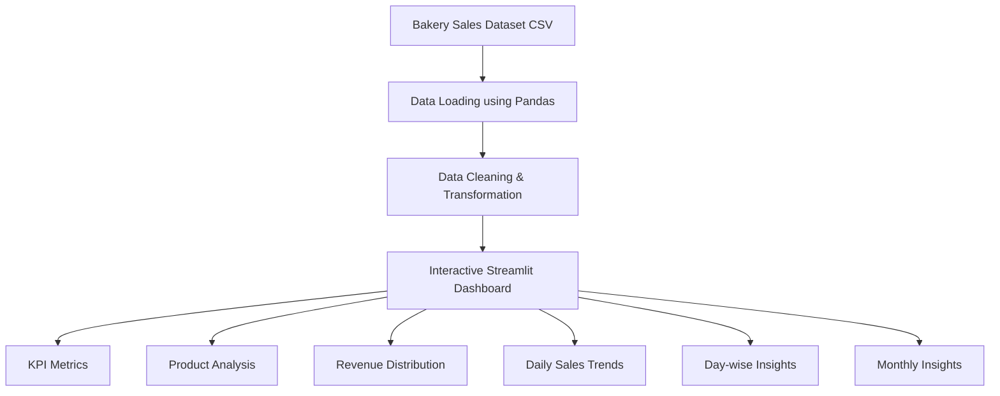
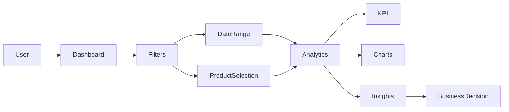

# 🍞 Bakery Sales Intelligence Dashboard

A powerful interactive bakery sales analytics dashboard built using **Python, Streamlit, Pandas, and Matplotlib**. This project helps bakery owners and business analysts monitor sales performance, identify top-selling products, analyze revenue trends, and make data-driven decisions.

---

## 📸 Dashboard Preview

### Main Dashboard


### Sales Analytics


### Revenue Distribution


> 📌 Create an `images/` folder in your repository and replace the above placeholders with actual dashboard screenshots.

---

## 🚀 Live Demo

🔗 **Application:**  
https://bakerymanagementsystem-e7ejgffdbyr487pb4zhder.streamlit.app/

---

# 📖 Project Overview

The Bakery Sales Intelligence Dashboard processes bakery sales data and presents meaningful insights through interactive visualizations and KPI metrics.

The system enables users to:

- Monitor total revenue
- Track customer orders
- Identify best-selling products
- Analyze sales trends over time
- Study day-wise and month-wise performance
- Filter reports using custom date ranges and product selections

---

# ✨ Features

## 📊 KPI Dashboard

Displays important business metrics:

- 💰 Total Revenue
- 🧾 Total Orders
- 🏆 Top Selling Product

---

## 🔍 Interactive Filters

Users can filter data using:

- Date Range Selection
- Product Selection

This allows focused analysis of specific periods or bakery items.

---

## 📈 Sales Trend Analysis

Visual representation of:

- Daily Revenue Trends
- Sales Growth Patterns
- Seasonal Demand Changes

---

## 🍰 Product Performance Analytics

Analyze:

- Most Sold Products
- Revenue Contribution by Product
- Product Popularity

---

## 📅 Day-wise & Monthly Insights

Business owners can discover:

- Best Performing Days
- Monthly Revenue Trends
- Customer Purchasing Patterns

---

# 🏗️ System Architecture



---

# 🗺️ Application Workflow



---

# 📂 Project Structure

```text
BakeryManagementSystem/
│
├── app.py
├── requirements.txt
├── README.md
│
├── data/
│   └── bakery_sales_2000.csv
│
├── images/
│   ├── dashboard-overview.png
│   ├── sales-analysis.png
│   └── revenue-distribution.png
│
└── .vscode/
```

---

# 🛠️ Technologies Used

| Technology | Purpose |
|------------|----------|
| Python | Core Programming Language |
| Pandas | Data Processing & Analysis |
| Streamlit | Dashboard Development |
| Matplotlib | Data Visualization |
| CSV Dataset | Sales Data Storage |

---

# 📦 Installation

## Clone Repository

```bash
git clone https://github.com/yourusername/BakeryManagementSystem.git
cd BakeryManagementSystem
```

## Install Dependencies

```bash
pip install -r requirements.txt
```

## Run Application

```bash
streamlit run app.py
```

---

# 📊 Dashboard Components

### KPI Section

- Revenue Calculation
- Order Count
- Top Product Identification

### Product Analytics

- Top Selling Products Bar Chart
- Product Revenue Contribution Pie Chart

### Trend Analysis

- Daily Sales Trend Graph
- Monthly Revenue Tracking

### Advanced Insights

- Day-wise Sales Comparison
- Month-wise Sales Performance

---

# 📈 Sample Business Insights

The dashboard can reveal insights such as:

- Cakes generate the highest revenue.
- Weekend sales outperform weekdays.
- Certain products contribute disproportionately to revenue.
- Monthly trends can identify seasonal demand spikes.

---

# 🔮 Future Enhancements

- User Authentication
- Inventory Management
- Customer Analytics
- Demand Forecasting using Machine Learning
- Automated Sales Reports
- Export to Excel/PDF
- Real-Time Database Integration

---

# 🤝 Contributing

Contributions are welcome.

1. Fork the repository
2. Create a feature branch

```bash
git checkout -b feature-name
```

3. Commit changes

```bash
git commit -m "Added new feature"
```

4. Push branch

```bash
git push origin feature-name
```

5. Create a Pull Request

---

# 📜 License

This project is licensed under the MIT License.

---

# 👨‍💻 Author

**Gaurav Tyagi**

Built with ❤️ using Python, Streamlit, and Data Analytics.
